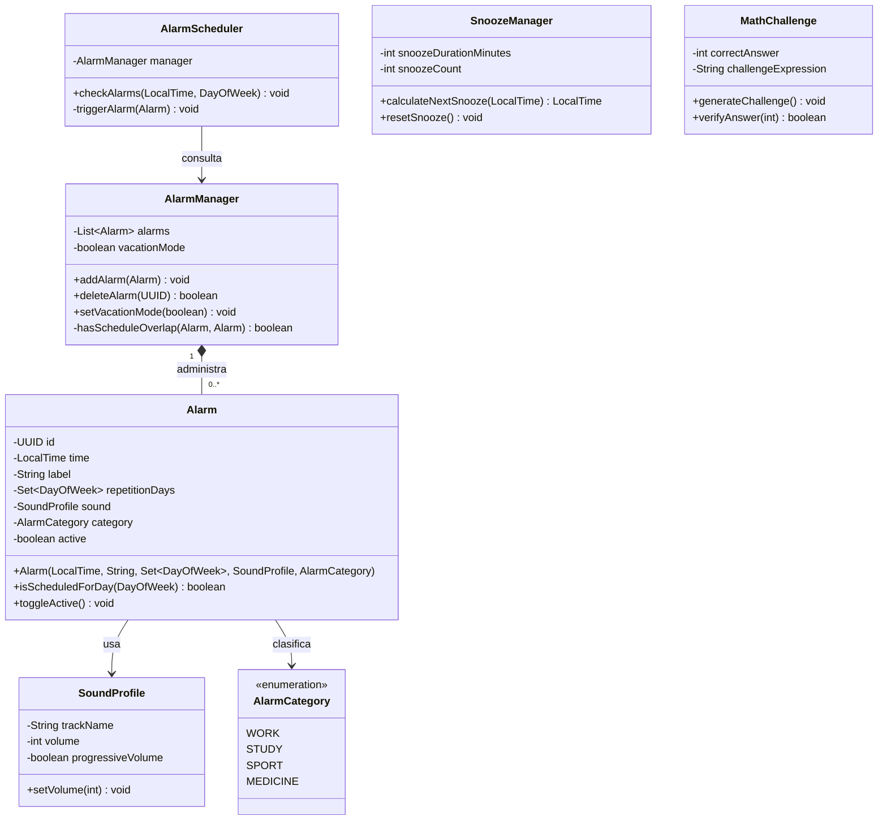
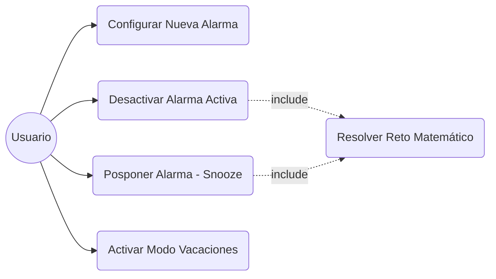

# 🤖 Smart Alarm System - Lógica de Negocio OO

Este repositorio contiene el diseño y la implementación modular de la lógica interna para un sistema de alarma inteligente avanzado, emulando las capacidades operativas de los teléfonos inteligentes modernos. Desarrollado exclusivamente en **Java** bajo un entorno sin interfaz gráfica.

---

## 🎯 Objetivos del Proyecto
* **Análisis de Requisitos Extensivos:** Desacoplamiento total entre las entidades de configuración de datos y el motor del planificador.
* **Encapsulación Rígida:** Restricción de acceso mediante visibilidad privada (`private`) en atributos clave con validaciones consistentes en mutadores.
* **Estructuras de Datos Eficientes:** Uso de colecciones `Set` para prevenir inconsistencias en las repeticiones semanales.

---

## 📁 Estructura de Directorios

```text
smart-alarm-system/
├── src/
│   ├── Alarm.java
│   ├── AlarmCategory.java
│   ├── AlarmManager.java
│   ├── AlarmScheduler.java
│   ├── Main.java
│   ├── MathChallenge.java
│   ├── SnoozeManager.java
│   └── SoundProfile.java
├── docs/
├── tests/
└── README.md

```



#### 📝 Justificación Técnico-Estructural del Diseño:
* **Principio de Responsabilidad Única (SOLID - SRP):** Se ha estruturado el dominio aislando responsabilidades. La clase `Alarm` funciona como una entidad pura contenedora de estado. La gestión del almacenamiento y el algoritmo de control de colisiones horarias quedan relegados a `AlarmManager`. A su vez, la evaluación cronológica se desacopla en `AlarmScheduler`, impidiendo que las entidades de datos dependan del motor de ejecución temporal.
* **Relaciones y Ciclo de Vida:** Se aplica una relación de **composición** (`1` a `0..*`) desde `AlarmManager` hacia `Alarm` mediante el operador `*--`. Esto responde a que las alarmas carecen de sentido operativo en el dominio si el gestor de alarmas central es destruido. Las entidades de audio (`SoundProfile`) y clasificación (`AlarmCategory`) se vinculan por **asociación simple**, modularizando de forma correcta propiedades estéticas y taxonómicas.
* **Encapsulación Defensiva:** Todos los atributos del sistema usan visibilidad privada (`-`). Los mutadores públicos (`+`) incluyen reglas de control perimetral; por ejemplo, el método `SoundProfile.setVolume(int)` valida los límites previniendo que el volumen adopte valores incoherentes fuera del rango entre 0 y 100%.

---

### B. Diagrama de Casos de Uso



#### 📝 Justificación del Diagrama de Casos de Uso:
* **Relaciones de Inclusión (Include):** Se justifica la relación de inclusión (`include`) hacia el caso de uso secundario "Resolver Reto Matemático" debido a que las especificaciones de comportamiento del sistema imponen de manera estricta y automatizada superar el desafío aritmético antes de permitir que una alerta sonora activa sea silenciada permanentemente o pospuesta temporalmente.

---

## 📝  Especificación de Casos de Uso

### Caso de Uso 1: Configurar Nueva Alarma con Detección de Conflictos
* **Nombre:** Configurar Nueva Alarma.
* **Objetivo:** Registrar una alarma controlando de manera inteligente la proximidad horaria con otras alertas configuradas.
* **Actor principal:** Usuario.
* **Precondiciones:** El sistema se encuentra en ejecución operativa y con la memoria inicializada.
* **Flujo principal:**
    1. El usuario define la hora (`LocalTime`), días de repetición, sonido, categoría y etiqueta descriptiva de la alarma.
    2. El sistema procesa la solicitud invocando al método `AlarmManager.addAlarm()`.
    3. El sistema valida las posibles colisiones temporales con otras alarmas existentes.
    4. El sistema almacena la alarma satisfactoriamente en la lista.
* **Flujos alternativos:**
    * **3.A. Conflicto horario detectado:** Si la alarma coincide en días de repetición con otra alarma activa y la diferencia horaria es menor o igual a 3 minutos:
        * El sistema lanza una alerta por consola: `[⚠️ ALERTA CONFLICTO]: La alarma está muy cercana...`
        * El sistema permite guardar el registro por flexibilidad funcional, pero notifica explícitamente el solapamiento.
* **Postcondiciones:** La alarma queda registrada y disponible en el planificador de alertas.

### Caso de Uso 2: Desactivación / Posposición por Reto Matemático
* **Nombre:** Gestionar Alarma Sonando.
* **Objetivo:** Imponer la resolución cognitiva de un problema matemático antes de permitir silenciar o posponer el audio de la alerta.
* **Actor principal:** Usuario.
* **Precondiciones:** El motor del reloj coincide exactamente con la hora y día programados de una alarma activa.
* **Flujo principal:**
    1. El sistema simula el disparo físico del sonido e imprime los datos por la consola pública.
    2. Genera de forma aleatoria una expresión aritmética de tipo combinatoria `(A * B) + C` mediante la clase `MathChallenge`.
    3. Solicita la solución numérica por teclado.
    4. El usuario introduce el valor entero equivalente al resultado.
    5. El sistema procesa la validación, muestra `✅ [RETO SUPERADO]` y silencia el sonido.
* **Flujos alternativos:**
    * **4.A. El usuario solicita posposición (Snooze):** Si introduce el valor `0` por teclado:
        * `SnoozeManager` incrementa el contador de reintentos y calcula el nuevo tiempo de disparo retrasando la alarma 5 minutos.
    * **4.B. Respuesta incorrecta:** Si el cálculo numérico es erróneo:
        * Muestra la alerta `❌ [RETO INCORRECTO]: Respuesta errónea...` y reejecuta el paso 3 en bucle solicitando una nueva resolución.
* **Postcondiciones:** El sonido de la alarma activa se detiene de forma definitiva (apagar) o de forma transitoria (snooze).

---

## 🧠  Reflexiones Técnicas y de IA

### Reflexión Técnica de Diseño
* **Colecciones y Calendario:** La selección explícita del uso de la interfaz `Set<DayOfWeek>` para albergar los días de repetición semanal asegura por diseño de código que el sistema impida estados duplicados incoherentes (por ejemplo, registrar dos veces el "Lunes" para una misma alarma), blindando la consistencia interna.
* **Simultaneidad:** El bucle de evaluación horaria del motor `AlarmScheduler` recorre la secuencia de alarmas de manera lineal en cada minuto. En el caso extremo de que dos alarmas coincidan en el mismo minuto y día, ambas se ejecutarán secuencialmente por consola de manera consecutiva sin pisar los flujos de memoria.
* **Deuda Técnica:** El mecanismo de interacción implementado mediante `Scanner` detiene de forma síncrona el hilo principal de la aplicación (`Main Thread`). Como mejora de infraestructura para entornos comerciales, el control del teclado y la simulación del reloj operativo deberían ejecutarse en hilos independientes (`Multi-threading`) para evitar la congelación del tiempo del sistema mientras el usuario resuelve la operación matemática.

### Informe sobre el Uso de IA
* **Herramientas:** ChatGPT / Claude.
* **Prompts Utilizados:**
  1. *"Genera una clase en Java llamada MathChallenge que calcule de manera pseudoaleatoria una operación combinada de multiplicación y suma simple, guarde el resultado e incluya un validador."*
  2. *"Diseña un algoritmo en Java para comprobar si dos alarmas coinciden en sus colecciones Set de días de repetición en un gestor general."*
* **Corrección Manual:** La sugerencia de código automática generada inicialmente por la IA para evaluar colisiones de días no manejaba adecuadamente los conjuntos vacíos (alarmas de una sola vez). Se modificó manualmente la lógica del método privado `AlarmManager.hasScheduleOverlap` para forzar que si el conjunto de repeticiones de alguna de las alarmas comparadas está vacío, devuelva `true`, asegurando así la detección defensiva de conflictos temporales.

---


